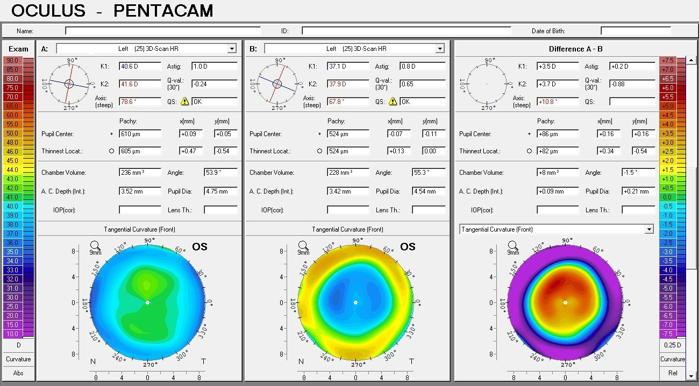
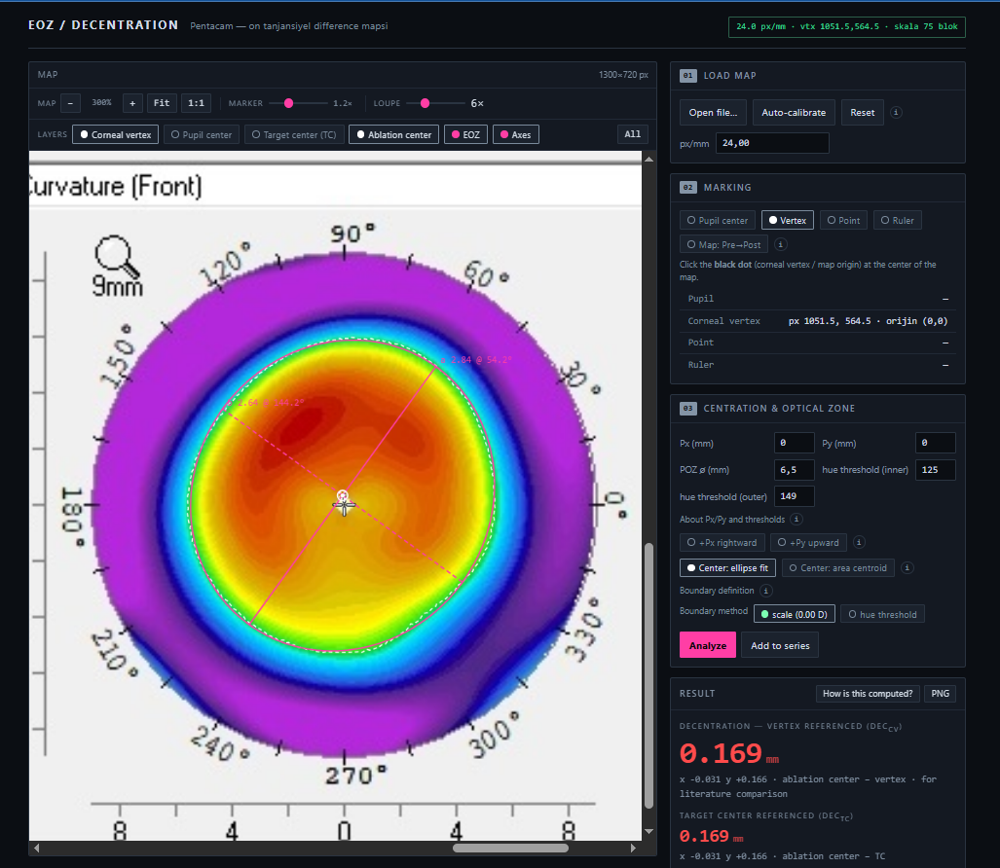

# EOZ Analyzer

A browser-based tool for measuring the **Effective Optical Zone (EOZ)** and **decentration** on Pentacam tangential curvature difference maps (TCDM) after corneal refractive surgery (SMILE / KLEx / FS-LASIK).

**Current version: v1.0.0** — this is the version referenced in the accompanying manuscript and permanently archived on Zenodo (DOI: [10.5281/zenodo.22150239](https://doi.org/10.5281/zenodo.22150239)). Later commits to `main` may include changes not reflected in the published analysis; always cite the archived DOI or a specific tagged [release](https://github.com/drmehmetaltun/EOZ-Automated-Measurement/releases) rather than the repository in general.

**[Live Demo →](https://drmehmetaltun.github.io/EOZ-Automated-Measurement/)**

*Example input: a Pentacam anterior tangential curvature difference map (standard 1300×720 export) — this is the raw screenshot format the tool expects.*

*The tool in action: EOZ boundary (green contour), fitted ellipse, major/minor axes, and corneal vertex overlaid on the same map, with the result panel showing computed decentration and other parameters.*

## Purpose

Manual measurement of the effective optical zone on corneal tangential difference maps (e.g. with ImageJ) is time-consuming and depends on the operator's threshold and tracing choices. This tool automates the full pipeline — vertex detection, scale calibration, 0.00 D boundary extraction, ellipse fitting, and decentration calculation — from a single screenshot, entirely client-side in the browser. It was built to support a validation study comparing automated vs. manual (ImageJ) EOZ measurement after SMILE/KLEx and FS-LASIK, and is released so other groups can reproduce or extend the method.

## Input Image Requirements

- **Source:** Pentacam anterior tangential curvature *difference* map (post-op minus pre-op, or the reverse — both directions are supported)
- **Standard export size: 1300×720 px.** At this resolution a fixed template vertex coordinate is used as a fallback; other resolutions rely on automatic black-dot detection
- **Format:** PNG or JPEG screenshot of the Pentacam display, including the **vertical color scale bar** (needed for the scale-based 0.00 D boundary) and the **ruler tick marks** (needed for px/mm calibration)
- The corneal vertex must appear as the small **black dot** at the map center — this is the point Pentacam labels "apex" but which anatomically corresponds to the **corneal vertex** (coaxially sighted corneal light reflex), not the geometric curvature apex (Chang & Waring, *Am J Ophthalmol* 2014)
- Higher resolution / less JPEG compression improves accuracy, particularly of vertex detection

## EOZ Definition (0.00 D Contour)

The effective optical zone is defined as the region enclosed by the **0.00 D iso-line** on the tangential difference map — i.e. the boundary of the treatment effect. Two extraction methods are available:

- **Scale-based (default, recommended):** the color scale bar is read and converted into a pixel→dioptre lookup; the 0.00 D contour is then extracted by radial interpolation between the last sample above and first sample below the target value, at sub-pixel accuracy. This does not require the 0 D band to be visually resolvable in the image.
- **Hue-based (fallback):** when the scale bar cannot be read, HSV hue thresholds locate the boundary instead. Because the green band represents a *range* around zero, two thresholds (inner/outer edge) are used and averaged to the band midpoint rather than relying on a single edge, which would systematically bias the measured area.

## Calibration Method

1. **Scale (px/mm):** derived from the vertical ruler bar next to the map. Consecutive tick marks are 1 mm apart; the median inter-tick spacing gives the pixel/mm ratio.
2. **Corneal vertex (map origin):** detected as the black dot inside the white fixation ring, using connected-component analysis. For the standard 1300×720 Pentacam export, a fixed template coordinate is used when auto-detection is unreliable (e.g. very low resolution or heavy JPEG compression washes out the 1–2 pixel dot).

All subsequent measurements (centers, axes, decentration) are reported in millimeters relative to this vertex-based origin.

## Decentration Definition

Two decentration values are reported, both derived from the **ablation center** (= EOZ center, measured from the map — where the treatment actually landed):

- **dec_CV** (vertex-referenced): `| ablation center − corneal vertex |` — comparable to ImageJ-based literature, which reports decentration relative to the vertex/pupil axis
- **dec_TC** (target-referenced, optional): `| ablation center − target center |`, where target center = pupil center (manually marked) + the surgeon's entered centration offset (Px, Py). This measures technical fidelity (eye tracking, cyclotorsion, fixation) rather than anatomical decentration, and is only available when the pupil is marked.

The ablation center itself can be computed two ways — ellipse-fit center (default) or area centroid — and the tool flags eyes where these diverge, indicating an irregular (non-elliptical) zone.

## Major Algorithm Steps

1. Load image → convert to HSV color space
2. Detect corneal vertex (black dot) and calibrate scale from the ruler bar
3. Read the color scale bar and build a pixel-color → dioptre lookup (or fall back to hue thresholding)
4. Extract the 0.00 D boundary via radial interpolation from the map center, sampling along ~360 semi-meridians
5. Fit an ellipse to the boundary points (Halır–Flusser direct least-squares algebraic method)
6. Compute EOZ area (contour polygon, shoelace formula), equivalent diameter, major/minor axes, meridian (TABO convention), eccentricity, and axis ratio
7. Compute ablation center (ellipse-fit and area-centroid definitions) and both decentration values
8. Compute retention ratio (EOZ area / programmed optical zone area) and zone irregularity (RMS radial residual from the fitted ellipse)
9. Render results and optionally export as CSV (single eye or batch of up to 500 images)

## Validation

The computational core was validated against a Python reference implementation — 17/17 parameters matched to machine precision (≈1e−15) on the same test image. In a separate clinical validation study (116 eyes), agreement with ImageJ-based manual measurement was strong:
- EOZ area ICC = 0.999
- Equivalent diameter ICC = 0.999
- Decentration ICC = 0.95–0.98
- Dice coefficient = 0.986

## Features

- **Zero-install**: single HTML file, works in any modern browser, no data leaves your machine
- **Dual boundary detection**: scale-based (0.00 D iso-contour) or hue-based (color threshold), with automatic threshold adjustment for Pre→Post vs. Post→Pre subtraction direction
- **Batch processing**: drag up to 500 images, get a CSV + HTML summary report
- **Interactive tools**: point probe (coordinate readout) and ruler (two-point distance measurement) on the map
- **Optional pupil marking**: target-center-referenced decentration is computed only when marked; vertex-referenced decentration is always available
- **Retention ratio**: EOZ / POZ, quantifying optical zone shrinkage

## Quick Start

1. Download `index.html` (or clone this repo) — or just use the [live demo](https://drmehmetaltun.github.io/EOZ-Automated-Measurement/)
2. Open it in Chrome, Firefox, Safari, or Edge
3. Drag-and-drop a Pentacam TCDM screenshot onto the upload area
4. The tool auto-detects the vertex and calibrates the scale
5. Set the **POZ diameter** (programmed optical zone) and click **Analyze**

## Output Parameters

| Parameter | Description |
|---|---|
| EOZ area (mm²) | Contour area (shoelace) and ellipse area (π·a·b) |
| Equivalent diameter (mm) | √(4·area/π) |
| Major / minor axis (mm) | From algebraic ellipse fit (Halır–Flusser) |
| Major meridian (°) | TABO convention |
| Eccentricity, axis ratio | Shape descriptors |
| dec_TC (mm) | Decentration from target center (requires pupil marking) |
| dec_CV (mm) | Decentration from corneal vertex |
| Retention ratio (%) | EOZ / POZ × 100 |

## Requirements

- A modern web browser (Chrome 90+, Firefox 88+, Safari 15+, Edge 90+)
- Pentacam TCDM screenshots (PNG or JPEG; higher resolution = better accuracy)

## License

[MIT](LICENSE)

## Citation Information

If you use this tool in a publication, please cite the manuscript:

> *Manuscript in preparation — citation details will be added upon publication.*

Please also cite the specific software version you used:

> Altun M. EOZ Analyzer (v1.0.0) [Computer software]. Zenodo. https://doi.org/10.5281/zenodo.22150239

## Contributing

Issues and pull requests are welcome. The entire application is a single HTML file with no build step — open `index.html` in a text editor to get started.

